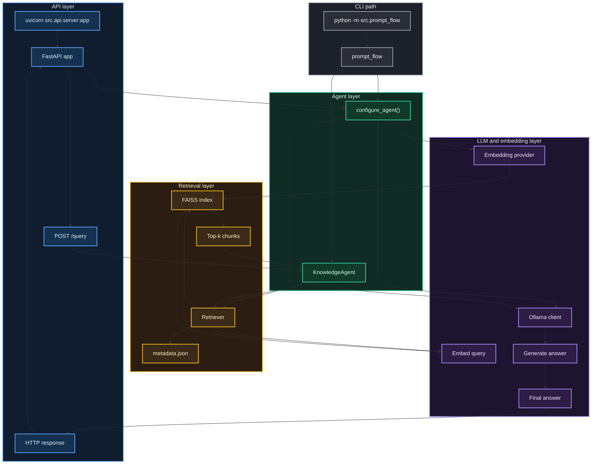

# Local Open RAG Platform (LORP) Runtime Flow

```mermaid
flowchart TD
    subgraph API[API layer]
        direction LR
        A["uvicorn src.api.server:app"]
        B["FastAPI app"]
        I["POST /query"]
        O["HTTP response"]
    end

    subgraph AGENT[Agent layer]
        direction LR
        C["configure_agent()"]
        J["KnowledgeAgent"]
    end

    subgraph RETRIEVAL[Retrieval layer]
        direction LR
        E["Retriever"]
        G["FAISS index"]
        H["metadata.json"]
        L["Top-k chunks"]
    end

    subgraph MODEL[LLM and embedding layer]
        direction LR
        D["Embedding provider"]
        F["Ollama client"]
        K["Embed query"]
        M["Generate answer"]
        N["Final answer"]
    end

    subgraph CLI[CLI path]
        direction LR
        P["python -m src.prompt_flow"]
        Q["prompt_flow"]
    end

    A --> B
    B --> C
    B --> I
    C --> D
    C --> E
    C --> F

    D --> G
    E --> H
    E --> G

    I --> J
    J --> E
    E --> K
    K --> G
    G --> L
    L --> J
    J --> F
    F --> M
    M --> N
    N --> O
    O --> B

    P --> Q
    Q --> C
    Q --> J

    classDef api fill:#14314f,stroke:#60a5fa,stroke-width:2px,color:#e0f2fe;
    classDef agent fill:#123a2b,stroke:#34d399,stroke-width:2px,color:#d1fae5;
    classDef retrieval fill:#3a2a17,stroke:#fbbf24,stroke-width:2px,color:#fef3c7;
    classDef model fill:#2d1d45,stroke:#a78bfa,stroke-width:2px,color:#f3e8ff;
    classDef cli fill:#2a2d36,stroke:#9ca3af,stroke-width:2px,color:#f3f4f6;

    class A,B,I,O api;
    class C,J agent;
    class E,G,H,L retrieval;
    class D,F,K,M,N model;
    class P,Q cli;

    style API fill:#0f1d2f,stroke:#60a5fa,stroke-width:2px,color:#e2e8f0;
    style AGENT fill:#102c24,stroke:#34d399,stroke-width:2px,color:#d1fae5;
    style RETRIEVAL fill:#2c1d12,stroke:#fbbf24,stroke-width:2px,color:#fef3c7;
    style MODEL fill:#1d1430,stroke:#a78bfa,stroke-width:2px,color:#f3e8ff;
    style CLI fill:#1d2129,stroke:#9ca3af,stroke-width:2px,color:#f3f4f6;
```
